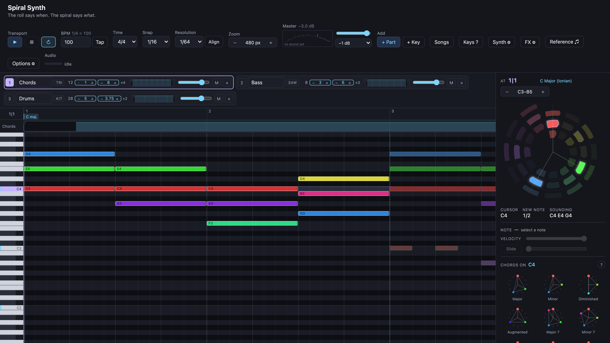
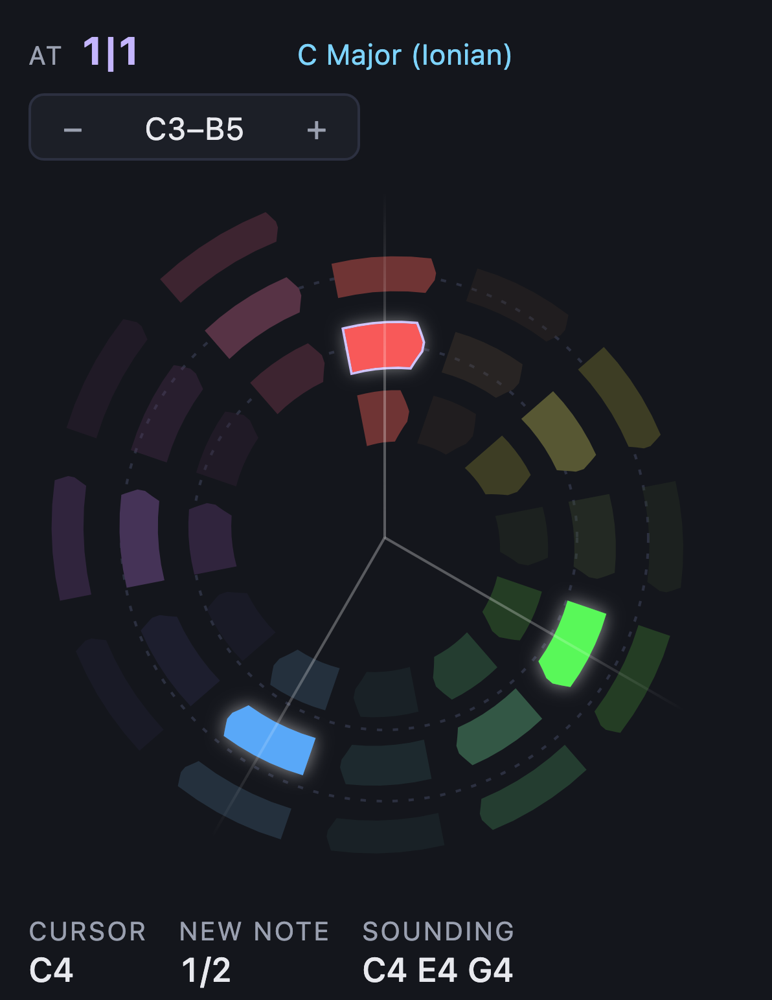
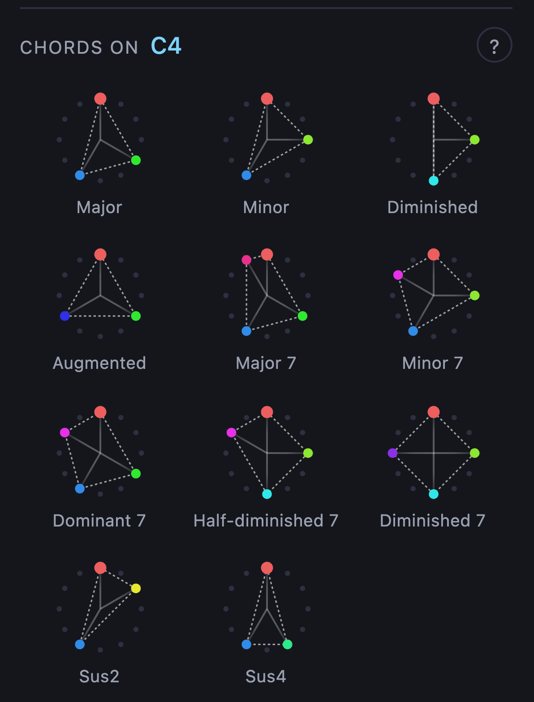
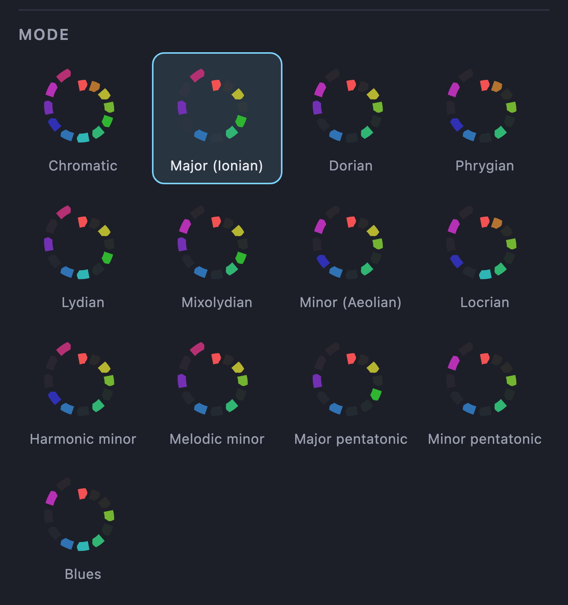

<div align="center">

# Spiral Synth

**The roll says _when_. The spiral says _what_.**

A browser DAW built around a chromatic pitch-spiral, where a chord is a shape you can see.
No build step, no dependencies, no framework — ES modules served raw.


<br>



</div>

```bash
node server.js     # then open http://127.0.0.1:5173
```

---

## The idea

A prototype for testing one idea about music notation: that **pitch class is best read as an
angle**. It is now built as an ordinary DAW — a piano roll, a cursor, a transport — with the
spiral demoted from *the* notation to a single editor panel beside it.

That demotion is the result of the experiments, not a retreat from them. Three things came out
of running the spiral as a general notation:

- **The spiral is very good at chords.** Angle is pitch class, so an interval is a rotation, and
  a fifth is the same 210° whether it spans one semitone's worth of staff or three octaves. A
  major triad is one triangle at every root. Nothing on a staff does that.
- **The spiral is a bad general notation.** It spends a whole 2D plane to display one number.
  Giving one of those dimensions to time leaves nothing to pack notes into: at ~112px a step, a
  lane held about three quarters of a bar of sixteenths, and there was no reasonable way to
  write notes in quick succession.
- **Fixed per-step durations are too inflexible to compose with.** A step owned one length and
  every note in it started and stopped together, which is a drum machine, not a piece of music.

So the plane is worth buying **once**, not once per time-step, and it should be bought for the
job it is actually good at. The roll says *when*. The spiral says *what*.


## The two halves

**The piano roll** is deliberately unremarkable: pitch up the page, time across it, a note is a
rectangle as wide as it is long. Nothing about it is the experiment. It is here because the
spiral needs a dense, boring, high-capacity surface next to it before any claim about the spiral
means anything — you cannot judge a chord notation on music you cannot write down.

**The spiral** is 36 semitones as a 3-turn chromatic dial, showing whatever sounds at the cursor:

- **Angle** = pitch class — 12 semitones spaced 30° apart, like a clock.
- **Radius / turn** = octave, three of them, with the middle turn as the reference octave.
- **Colour** = pitch class, the same hue the note has in the roll.
- Each slot **narrows toward its leading end**, so it shows which way round the spiral pitch
  increases without needing anything else on screen to compare against.

<table>
<tr>
<td width="50%" valign="top" align="center">

<br><sub><em>C major at the cursor — three lit slots, and the angles between them.</em></sub>
</td>
<td width="50%" valign="top" align="center">

<br><sub><em>The palette. Each chord is one shape, and it is that shape at every root.</em></sub>
</td>
</tr>
</table>

## The cursor

One vertical line through the whole roll, at one moment in the song. It is not a selection and
not a note — it is a *time*, so it can sit inside a held chord rather than only between notes.

Everything follows from it. The spiral draws what sounds there. A note made on the spiral starts
there. `Enter` toggles whatever the cursor and the pitch cursor cross. During playback the
playhead is a second, blue line, and with **Follow playhead** on the cursor rides it.

The **pitch cursor** is the other half: a row in the roll and an outlined slot on the spiral,
moved with `↑` `↓`. It belongs to the editing session rather than to any one moment, so it stays
where you left it when you move along the song — which is what makes `→ Enter → Enter` a way to
enter a line.

## What is on screen

| Panel | |
|---|---|
| **Roll** | the song — parts, notes, the ruler, the key gutter, the fade lane |
| **Spiral** | what sounds at the cursor, and the chord palette |
| **Key ✱** | the key, thirteen modes as dials, and the chords that fit |
| **Synth** | the current part's instrument, built from whatever that instrument declares |
| **FX** | the effect chain for a part, and for the master bus |
| **Scope** | spectrum, sweep and map views of the current voice |
| **Reference** | an imported recording, laid against the bars |
| **Songs** | naming, listing, loading, deleting |
| **Options ⚙** | the behaviours that are still open questions, defined in `src/settings.js` |

The **Key ✱** panel is where the notation argues for itself. A dropdown cannot make the case —
`Phrygian` is a word — so the modes are thirteen dials instead, each one a single turn of the
spiral with that mode shaded onto it. Lydian beside Major is one slot moving a step round the
circle, which is the thing the words never said.

<div align="center">

</div>

## Keyboard

Aiming at a 13-pixel row was never the good part. The arrows split the way the screen is laid
out — **horizontal is time, vertical is pitch** — and modifiers stay on one rule rather than
being learned per key: plain arrows move *you*, `⌥` arrows move the *notes you have selected*,
and `⇧` makes either one bigger.

| Key | |
|---|---|
| `Space` | play / stop, from the cursor |
| `←` `→` | move the cursor one snap step (`⇧` to the next bar line) |
| `↑` `↓` | move the pitch cursor a semitone (`⇧` an octave) |
| `Enter` | make or remove a note where the two cursors cross |
| `Tab` / `⇧Tab` | next / previous note in this part, taking the cursor with it |
| `⌥←` `⌥→` | move the selected notes in time |
| `⌥↑` `⌥↓` | transpose the selected notes (`⇧` by an octave) |
| `,` `.` | softer / harder — the velocity of the selected notes, a tenth at a time |
| `S` | slide — the selected notes arrive from the pitch struck before them |
| `[` `]` | shorter / longer by one snap step — the selection, or the next note if nothing is selected |
| `⌥[` `⌥]` | stretch the selection in time — double-time / half-time, lengths and gaps together |
| `D` | duplicate the selection, one selection-width later |
| `⌫` | delete the selection |
| `Home` `End` | start / end of the song |
| `1`…`9` | edit that part |
| `M` `L` `F` | mute this part · loop · follow playhead |
| `⌘Z` / `⇧⌘Z` | undo / redo |
| `⌘S` | keep this song under its name (see Saving) |
| `T` | tap the tempo — four taps is usually enough (see Transcribing) |
| `−` `+` | zoom out / in (or `⌘`-scroll over the roll, which zooms around the pointer) |

Undo is whole-song snapshots rather than a command log, taken once at the start of each gesture
— so a drag that moved eight notes across a hundred intermediate positions is one entry.

## Run it

No install, no build step, no dependencies — just a static file server built on Node's standard
library.

```bash
node server.js
```

Then open http://127.0.0.1:5173. The server binds to `127.0.0.1` only, so it is never reachable
from other devices on the network. All sound is synthesized locally with the Web Audio API — no
audio files, no network calls of any kind.

A browser that has been here before opens on the session it left (see Saving). A fresh one opens
on two bars of two parts in C major, chosen so the first screen shows what the arrangement is for:
the chords are halves and the bass is eighths, so the length a new note gets depends on which part
you are in and where the cursor is. The key marker at bar 1 is there for the same reason — unkeyed
the spiral draws no scale shading at all, which is honest and makes a poor first screen, since the
tiering is exactly what makes a chord readable on it.


## Tests

```bash
node --test tests/
```

No harness and no dependencies — `node:test` against the `*-dsp.js` modules, which are plain
arithmetic and import without a browser, plus the static server. See
[`tests/README.md`](tests/README.md) for what is covered and what deliberately is not.

## Where the code lives

<details>
<summary><b>Every module and what it owns</b> — the model, the surfaces, the DSP, the panels</summary>

<br>

**The song and the surfaces that edit it**

| | |
|---|---|
| `src/song.js` | the model — parts, notes, key markers, both cursors, selection, undo |
| `src/main.js` | the composition root — every panel built and wired to one song |
| `src/track-time.js` | where a part sits in the song, and how its material folds onto that |
| `src/piano-roll.js` | the grid, the ruler, the fade lane, the key gutter, and every pointer gesture on them |
| `src/roll-spectrum.js` | the recording drawn behind the notes - one blit, parked over the viewport |
| `src/roll-viewport.js` | where the roll is looking - reveal, centre, and following a kit's range |
| `src/track-rack.js` | the rack: one row per part, sitting above the roll |
| `src/time-scale.js` | how much room one whole note is worth - the roll's only zoom |
| `src/drum-lane.js` | the step lane — a drum grid over the same notes the roll edits |
| `src/edits.js` | operations reachable from more than one surface, so they cannot diverge |
| `src/keyboard.js` | the shortcut layer |

**The spiral, and everything that draws pitch**

| | |
|---|---|
| `src/spiral-panel.js` | binds the spiral to the cursor and turns its gestures into edits |
| `src/views/spiral-view.js` | the drawing: 36 slots, angle guides, ghosts, cursor outline |
| `src/spiral-geometry.js` | slot outlines, and the point-to-slot inverse dragging needs |
| `src/chord-tools.js` | the chord palette — the diagrams, and building what they draw |
| `src/views/chord-diagram.js` | a chord's shape as one flat turn, drawn once for both panels that show it |
| `src/views/scale-dial.js` | a mode as one turn of the spiral — what the key picket chooses between |
| `src/views/common.js` | shared vocabulary for anything that draws pitch |
| `src/key-editor.js` | the picket: the key, thirteen modes as dials, and the chords that fit |
| `src/note-tools.js` | the selected note as controls — velocity, and whether it slides |

**Time, playback and rendering**

| | |
|---|---|
| `src/grid.js` | snap and resolution — where starts and lengths are allowed to land |
| `src/meter.js` | the bar map — how long a bar is, how it divides, and how positions are counted |
| `src/tempo.js` | the tempo, in one place, so a synced delay can read it |
| `src/transport.js` | lookahead scheduling on one shared timeline |
| `src/timeline.js` | which notes are where — the one walk the transport and the exporter share |
| `src/export.js` | rendering the song offline, and writing a WAV by hand |
| `src/automation.js` | what is a function of where you are in the song — fades, and a synced sweep |
| `src/fade-lane.js` | a part's two fades, drawn as the part and dragged by its corners — at either scale |
| `src/audio.js` | the context, the bus chain, the clock, and the note accounting |
| `src/master-strip.js` | the fader, the level and reduction meters, and the ceiling |

**Instruments**

| | |
|---|---|
| `src/instruments.js` | the registry a part names an instrument from |
| `src/modulation.js` | sources, destinations and the matrix — defined once, realized on both threads |
| `src/instruments/subtractive.js` | oscillators, both envelopes, the filter sweep |
| `src/instruments/fm.js` | two-operator FM — a modulator bending a carrier, and an index envelope |
| `src/instruments/ladder.js` | the worklet instrument — WAM-shaped, async, its own DSP |
| `src/instruments/worklets/ladder-processor.js` | the audio-thread half: PolyBLEP oscillator, nonlinear ladder |
| `src/instruments/drums.js` | the kit — eleven drums on the GM map, named notes, step rows |
| `src/instruments/drum-map.js` | which note is which drum, read by the processor, gutter, scope and lane |
| `src/instruments/worklets/drum-processor.js` | the audio-thread half: eleven small synths in one processor |
| `src/instruments/wavetable.js` | the wavetable instrument — tables, morph, unison, and its own display |
| `src/instruments/worklets/wavetable-processor.js` | the audio-thread half: mip selection, unison phases, frame blend |
| `src/instruments/worklets/voice-dsp.js` | the arithmetic both processors share — ladder step, envelopes, unison |
| `src/instruments/filter-envelope.js` | where the cutoff was *told* to go, for the Sweep overlay |
| `src/instruments/builtins.js` | the one line adding an instrument costs |
| `src/engine.js` | a set of instruments bound to a context — the live one, and the render's |
| `src/synth-panel.js` | the voice panel, built from whatever the instrument declares |

**Effects**

| | |
|---|---|
| `src/effects.js` | the registry a chain names an effect from |
| `src/effects/chain.js` | a row of effects between two endpoints that never move |
| `src/effects/builtins.js` | the one line adding an effect costs |
| `src/effects/filter.js` | multi-mode filter on native biquads, and the Q-in-decibels conversion |
| `src/effects/compressor-dsp.js` | the compressor's arithmetic — gain computer, knee, ballistics |
| `src/effects/compressor.js` | its main-thread half, and the shell in `worklets/compressor-processor.js` |
| `src/effects/limiter-dsp.js` | the limiter's arithmetic — delay line, sliding minimum, no Web Audio |
| `src/effects/worklets/limiter-processor.js` | the audio-thread shell around it |
| `src/effects/limiter.js` | the main-thread half: two fixed endpoints, and a processor spliced in late |
| `src/effects/reverb-dsp.js` | the reverb's arithmetic — eight delay lines and a Hadamard matrix |
| `src/effects/reverb.js` | its main-thread half, and the shell in `worklets/reverb-processor.js` |
| `src/effects/delay-line.js` | a fractional ring buffer, a loop tone pair, and one soft clipper |
| `src/effects/delay-dsp.js` | the tape delay's arithmetic — glide with a speed limit, wow in cents |
| `src/effects/delay.js` | its main-thread half, and the shell in `worklets/delay-processor.js` |
| `src/effects/chorus-dsp.js` | the chorus's arithmetic — one LFO, three taps, a bounded feedback path |
| `src/effects/chorus.js` | its main-thread half, and the shell in `worklets/chorus-processor.js` |
| `src/effects/drive-curve.js` | the four shaping curves, and what normalises them |
| `src/effects/drive.js` | four native nodes: the shaper, a DC blocker, a tone lowpass, a trim |
| `src/effects/worklet-effect.js` | the endpoint splice every worklet effect shares |
| `src/fx-panel.js` | the chains on screen — add, remove, reorder, bypass |

**Analysis, and the imported recording**

| | |
|---|---|
| `src/fft.js` | one Fourier transform, forward and inverse, for everything that needs one |
| `src/wavetable.js` | band-limited tables: harmonic specs, the mip pyramid, Hermite playback |
| `src/analysis.js` | the FFT, and what a voice's spectrum says about it |
| `src/reference.js` | the imported recording — where it sits against the bars, and the monitor |
| `src/spectrum-worker.js` | the STFT, folded onto the semitone axis, off the main thread |
| `src/spectrum.js` | running that and painting it — the colour ramps, the floor, the band |
| `src/reference-panel.js` | the Reference panel, and the drop target on the roll |
| `src/beat-dsp.js` | onsets, tempo candidates, and the fit that makes them precise |
| `src/tempo-worker.js` | the shell that runs that off the main thread |
| `src/beat-detect.js` | the request, and why it always measures the mix |
| `src/worker-run.js` | one worker, one job, replacing whatever was still running |
| `src/perf.js` | what the audio thread will admit about how hard it is working |
| `src/analysis-panel.js` | the Scope panel and the header's load readout |
| `src/views/scope-view.js` | the scope's three pictures - spectrum, one sweep frame, and the map |

**Shared vocabulary, storage and settings**

| | |
|---|---|
| `src/music-theory.js` | pitch, scales, the duration lattice, snap sizes |
| `src/params.js` | what a knob is, on its own — no imports, so it cannot be in a cycle |
| `src/param-state.js` | building and checking a state from knob descriptors, for both registries |
| `src/param-controls.js` | one knob as a control, for both panels |
| `src/decibels.js` | gain to dB and back, in one place instead of four |
| `src/format.js` | how a knob's value is spelled out under it |
| `src/observable.js` | the subscribe/notify pair, written once |
| `src/worklet-loader.js` | loading a processor module once per context |
| `src/theme.js` | reading the stylesheet's colours from code that draws on a canvas |
| `src/storage.js` | localStorage, the autosave, and the document a song is saved as |
| `src/save-panel.js` | the Songs panel — naming, listing, loading, deleting |
| `src/demo-song.js` | the song a new browser opens with — a fixture, so it can be measured |
| `src/settings.js` | the behaviours that are still open questions, defined in one place |
| `src/options-panel.js` | the Options panel, built straight from those definitions |

</details>

## Why things are the way they are

Explanation lives in a header comment on the module it explains, where it sits next to the code it
describes. Start with the table above, then read the top of the file it points at — most of them
open with why the approach was chosen and what the alternatives cost.

Where a comment quotes an exact figure, the same figure is asserted in `tests/`, so the claim and
the check cannot drift apart.
